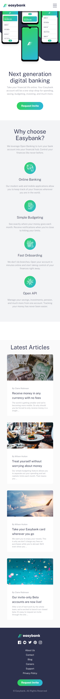
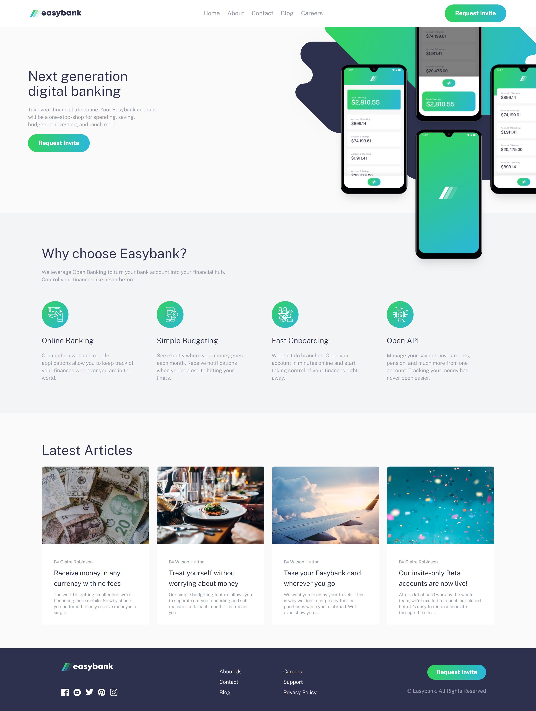

# Frontend Mentor - Easybank landing page solution

This is a solution to the [Easybank landing page challenge on Frontend Mentor](https://www.frontendmentor.io/challenges/easybank-landing-page-WaUhkoDN). Frontend Mentor challenges help you improve your coding skills by building realistic projects. 

## Table of contents

- [Frontend Mentor - Easybank landing page solution](#frontend-mentor---easybank-landing-page-solution)
  - [Table of contents](#table-of-contents)
  - [Overview](#overview)
    - [The challenge](#the-challenge)
    - [Screenshot](#screenshot)
    - [Links](#links)
  - [My process](#my-process)
    - [Built with](#built-with)
    - [Continued development](#continued-development)
    - [Useful resources](#useful-resources)
  - [Author](#author)

**Note: Delete this note and update the table of contents based on what sections you keep.**

## Overview

### The challenge

Users should be able to:

- View the optimal layout for the site depending on their device's screen size
- See hover states for all interactive elements on the page

### Screenshot

### Links

- Solution URL: [solution URL here](https://www.frontendmentor.io/solutions/easybank-landing-page-using-react-and-tailwindcss-11MGk1gXsi)
- Live Site URL: [live site URL here](https://easybank-landing-page-navy-eight.vercel.app/)

## My process

### Built with

- Semantic HTML5 markup
- Mobile-first workflow
- [React](https://reactjs.org/) - JS library
- [TailwindCSS](https://www.tailwindcss.com)

### Continued development

- Creating more projects with React and Tailwind CSS.
- Practising layouts

### Useful resources

- [Tailwind CSS Docs](https://www.tailwindcss.com)

## Author

- Website - [Ronen Hammond](https://ronenhammond.netlify.app/)
- Frontend Mentor - [@Ronen_T_G](https://www.frontendmentor.io/profile/RonenTGreat)
- Twitter - [@Ronen_T_G](https://twitter.com/Ronen_T_G)
